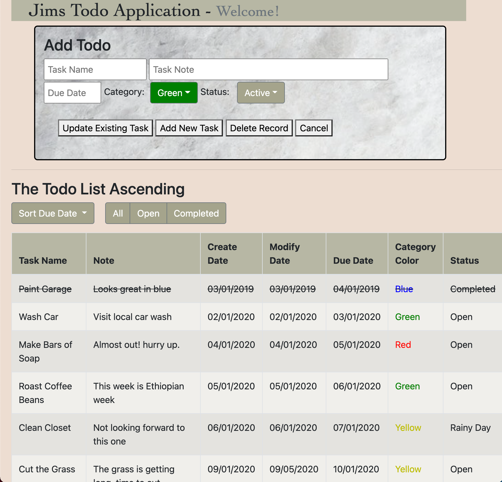

<!--  -->

# Weekend Todo List

## Description

_Duration: Weekend Sprint_

This web based ‘To Do’ list manager is a great way to track the various activities one should track in their daily lives.  Features a color coded category marker, as well as completed date tracking.  All data stored on backend PostgreSQL database.

To see the fully functional site, please visit: [DEPLOYED VERSION OF APP](https://www.JamesDBird.me)

## Screen Shot

`

## Installation

requires server.js to run in NodeJS.  Use "npm Start" script to start server.  Default is port 5000.  Install: bootstrap, PostgreSQL (pg), express.  Database file included in root of application files.  Bootstrap.bundle.js required for active pulldowns.  "npm install @chenfengyuan/datepicker" is required for the datepicker routine.

## Usage
Upon starting application, all tasks appear in table below entry area.   Click on any row to modify it's contents, or delete the row.  To add a new task, either populate the data from a row below by clicking on it, or enter fresh data, then select 'add new task'.   If edits would like to be cancelled, select 'cancel' and user input will be cleared out, and database will not be updated.  Enjoy!

## Built With

JQuery
HTML
NodeJS
Express
JavaScript
PostgreSQL

## Acknowledgement
Thanks to [Prime Digital Academy](www.primeacademy.io) who equipped and helped me to make this application a reality.  Vatti Rocks!

## Support
If you have suggestions or issues, please contact me at www.JamesDBird.com